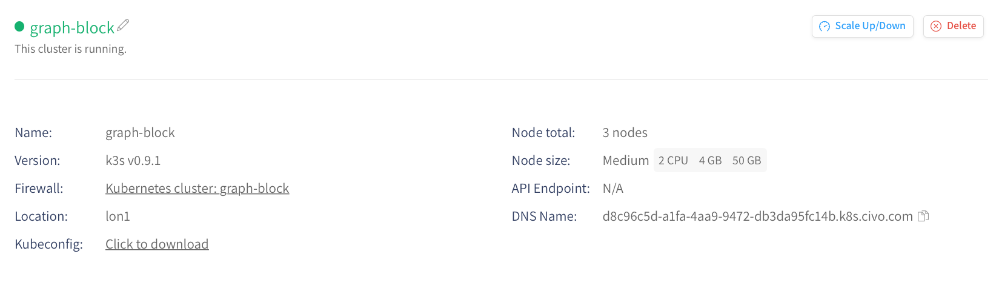
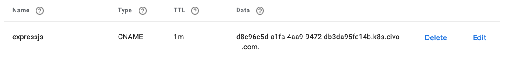
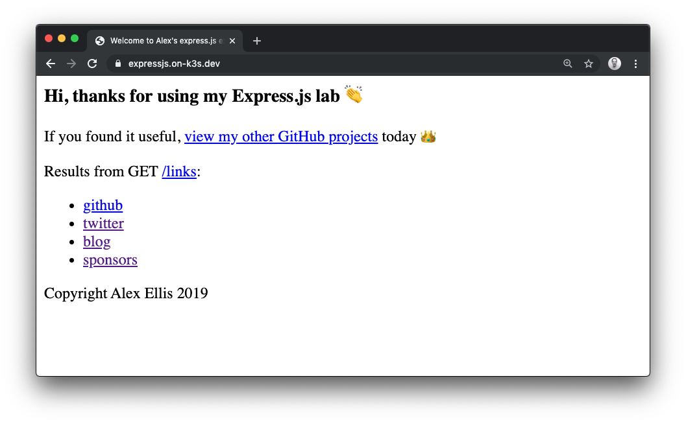
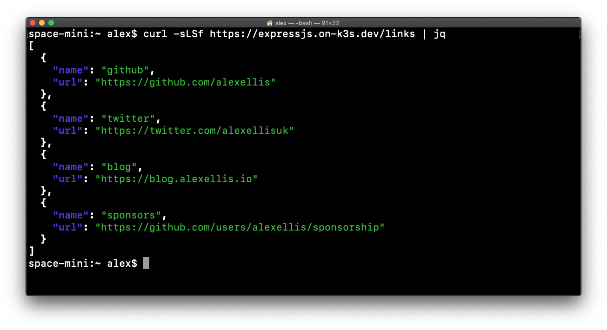

# Get a TLS cert for your application with JetStack's cert-manager

In this learn guide we will obtain a free TLS certificate LetsEncrypt for an application we have running on our Kubernetes cluster. The sample application will be written in [Node.js](https://nodejs.org/en/) using the popular microservices framework [Express.js](https://expressjs.com).

## Pre-reqs

* Create a Kubernetes cluster

    You can use an existing cluster, or if you don't have one yet, here's a couple of options for using [k3s](https://k3s.io), a light-weight Kubernetes distribution from Rancher.

    Create a VM on your favourite cloud and then download [k3sup](https://k3sup.dev). You can then run `k3sup install --ip $IP --user $USER` which will use `ssh` to log into the remote computer and install Kubernetes. You can use a Civo Instance if you like, just make sure you add your `ssh` key when setting up.

    The other option with Civo, if you're part of the [#Kube100 program](https://www.civo.com/blog/kube100-is-here) is to use the dashboard to create a cluster.

* [`k3sup` ('ketchup')](https://k3sup.dev/) - get k3s and helm charts with a single command

    We'll use `k3sup` to install `cert-manager`

    ```
    curl -SLsf https://get.k3sup.dev | sudo sh
    ```

    Available for MacOS, Windows, and Linux.

* A working `KUBECONFIG` and `kubectl`

    Once you have a new or existing cluster, get your `kubectl` command-line to point at it and verify that with `kubectl config get-contexts`

    > See also: [Setup and install `kubectl`](https://kubernetes.io/docs/tasks/tools/install-kubectl/)

* A domain name

    You'll need a domain and you can register one for as little as 2 USD from [namecheap.com](https://www.namecheap.com/). In the example I used [Google Domains](https://domains.google) and a .dev address, these cost between 10-15GBP at time of writing.

## Tutorial

First let's install cert-manager, and then a sample application written in Node.js. Once that's in place, we can explore the steps necessary to configure the TLS certificate. cert-manager will then obtain, manage, and renew the certificate for us on an on-going basis.


*Pictured: Conceptual diagram*

### Install cert-manager

If you're using Civo's k3s service, then when you create your cluster you can add an "app". If you're doing this after the fact you can run the following:

List the clusters

```
civo k8s ls

graph-block
```

Find your cluster and then install the `cert-manager` app. My cluster was called `graph-block`.

```
civo applications add cert-manager --cluster graph-block

Added cert-manager v0.11.0 to Kubernetes cluster graph-block
```

If you're not using Civo's k3s service then run the following instead:

```
k3sup app install cert-manager 
```

### Deploy the sample app

The sample application is an Express.js microservice built to show how to get started. It includes the following:

* a Dockerfile which can be used to rebuilt the code at any time
* a Deployment YAML file
* a Service YAML file
* the index.js and package.json used by Node.js

The sample comes with three endpoints which you can edit at a later time:

* `/` - serves a HTML page
* `/links` - serves a JSON response of links
* `/health` - serves a health endpoint giving 200 OK

Now clone the repo:

```
git clone https://github.com/alexellis/expressjs-k8s
cd expressjs-k8s
```

Apply the `Deployment` which will create a `Pod` in your cluster.

```
kubectl apply -f ./yaml/dep.yaml
```

Now apply the `Service`, which is of type `ClusterIP`. This type of service is not accessible outside of your cluster.

```
kubectl apply -f ./yaml/svc.yaml
```

Forward the port for the app to your local computer:

```
kubectl port-forward svc/expressjs 8080:8080
```

In a browser open http://127.0.0.1:8080

If you're new to writing Kubernetes YAML files then take a few moments to read over the two YAML files.

> See also: [Kubernetes by example](http://kubernetesbyexample.com) by [Michael Hausenblas](https://mhausenblas.info)

### Configure cert-manager for the sample app

We now need to create two additional objects in Kubernetes to get our certificate:

* Ingress - a routing definition for [Traefik](https://traefik.io) (the built-in k3s IngressController)
* Issuer - a definition for cert-manager to use for obtaining certificates

In addition to that, we must also create a record in our DNS system for the domain name.

#### Setup DNS

If you're using k3s then Traefik is installed by default and exposes port 80 and 443 on each node. Simply find the public IP of one of your nodes and create a DNS entry for it in your DNS provider.

* For a Civo Kube100 customer find the DNS entry in your dashboard

    

    Now create a CNAME record with the DNS entry i.e. `expressjs.example.com`

    

* For users of a VM with a public IP address

    Create an A record with the public IP, i.e. `expressjs.example.com`

#### Setup an Issuer

Now create an Issuer. Issuers are used by cert-manager to identify or authenticate your user. We'll use a HTTP01 Issuer which is only used to identify you and share your email address.

```yaml
apiVersion: cert-manager.io/v1alpha2
kind: Issuer
metadata:
  name: letsencrypt-prod
spec:
  acme:
    email: webmaster@expressjs.example.com
    server: https://acme-v02.api.letsencrypt.org/directory
    privateKeySecretRef:
      name: expressjs-secret-issuer-account-key
    solvers:
    - http01:
        ingress:
          class: traefik
```

Save the above file as `issuer.yaml` and change the email address.

Apply the file:

```
kubectl apply -f issuer.yaml
```

#### Setup the Ingress record

Now let's create the Ingress record. Save this file and edit `expressjs.example.com`, replacing that with your own domain.

```yaml
apiVersion: extensions/v1beta1 
kind: Ingress
metadata:
  name: expressjs
  annotations:
    cert-manager.io/issuer: letsencrypt-prod
    kubernetes.io/ingress.class: "traefik"
spec:
  tls:
  - hosts:
    - expressjs.example.com
    secretName: expressjs-secret
  rules:
  - host: expressjs.example.com
    http:
      paths:
      - backend:
          serviceName: expressjs
          servicePort: 8080
        path: /
```

Save the file as `ingress.yaml`, then run `kubectl apply -f ingress.yaml`.

### Try out your TLS cert

Access your site at: https://expressjs.example.com



You can also access a JSON API via `curl`:



If you don't see the certificate at once, check that you can `ping` your domain and that it gives the correct result. DNS configuration can take a few minutes to propagate throughout the Internet.

You can also debug and diagnose potential issues using the [cert-manager docs](https://docs.cert-manager.io/en/latest/) or by joining the [Kubernetes Slack](http://slack.kubernetes.io/) workspace.

## Wrapping up

You now have a Node.js website deployed with a free TLS certificate from LetsEncrypt. It's over to you to extend the functionality and to customise it as you see fit. Build your own API and/or webpage and share it with me [@alexellisuk](https://twitter.com/alexellisuk) or the [@CivoCloud](https://twitter.com/civocloud) community on Twitter.

### Customise the example

You can customise the example using this workflow:

* Edit the Node.js code in `index.js` or `routes/index.js`
* Build a new container image under your username (`docker build -t yourname/image:version .`)
* Push the image to the Docker Hub or a similar registry (`docker push yourname/image:version`)
* Update the `image: ` in `dep.yaml`
* Run `kubectl apply -f dep.yaml`

The TLS certificate, Ingress and Issuer all stay the same between iterations.

### Keep learning

Find out more about the projects we used today:

* [cert-manager](https://github.com/jetstack/cert-manager/)
* [k3sup](https://k3sup.dev/)
* [Civo #Kube100 program](https://www.civo.com/blog/kube100-is-here)
